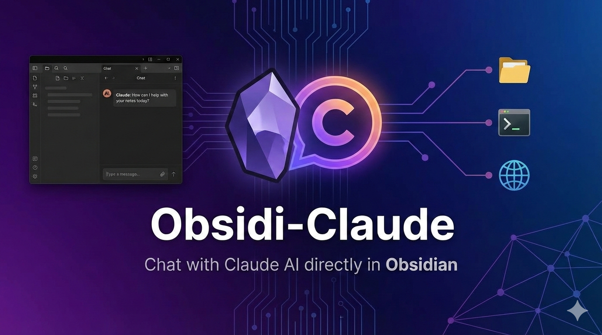

# Obsidi-Claude



Chat with Claude AI using the Agent SDK directly in Obsidian.

## Features

- **Full Agent SDK Integration** - Access Claude Code's capabilities directly in Obsidian
- **Tool Usage** - Claude can read/write files, run commands, search the web
- **Streaming Responses** - Real-time streaming of Claude's responses
- **Session Management** - Conversations persist and can be resumed
- **Configurable** - Control which tools Claude can use, permission modes, and more

## Requirements

- [Claude Code CLI](https://code.claude.com) installed and authenticated
- Obsidian Desktop (not mobile - uses Node.js features)
- Node.js 18+

## Installation

### Development

```bash
# Clone the repo
git clone <repo-url>
cd obsidi-claude

# Install dependencies
npm install

# Build
npm run build

# For development with auto-rebuild
npm run dev
```

### Linking to Obsidian

Create a symlink from your Obsidian vault's plugins folder:

```bash
ln -sfn /path/to/obsidi-claude /path/to/vault/.obsidian/plugins/obsidi-claude
```

## Usage

1. Enable the plugin in Obsidian Settings > Community Plugins
2. Click the message icon in the ribbon, or run "Open Claude Chat" command
3. Type your message and press Enter (or click Send)

## Configuration

Open Settings > Obsidi-Claude to configure:

- **Model**: Choose Claude Sonnet 4.5, Opus 4, or 3.5 Sonnet
- **Working Directory**: Where Claude operates (defaults to vault root)
- **Permission Mode**:
  - Default: Ask for confirmation before sensitive operations
  - Accept Edits: Auto-approve file changes
  - Bypass: No confirmations (use with caution)
- **Max Turns**: Limit conversation turns
- **Show Tool Calls**: Display when Claude uses tools
- **Allowed Tools**: Enable/disable specific tools

## Tools Available

When enabled, Claude can use:

- **Read**: Read file contents
- **Write**: Create new files
- **Edit**: Modify existing files
- **Glob**: Find files by pattern
- **Grep**: Search file contents
- **Bash**: Run shell commands
- **WebFetch**: Fetch web pages
- **WebSearch**: Search the web

## Architecture

```
Obsidian Plugin
    └── @anthropic-ai/claude-agent-sdk
            └── Claude Code CLI (subprocess)
                    └── Claude API
```

The plugin uses the official Claude Agent SDK which spawns Claude Code as a subprocess. This provides full access to Claude Code's capabilities including file operations, shell commands, and web access.

## Troubleshooting

### "Claude Code not found"

Ensure Claude Code CLI is installed and in your PATH:

```bash
claude --version
```

If not installed, visit [code.claude.com](https://code.claude.com) for installation instructions.

### Plugin not loading

Check Obsidian's developer console (Cmd+Option+I) for errors. Common issues:

- Node.js version too old (need 18+)
- Claude Code not authenticated (run `claude login`)

## License

MIT


